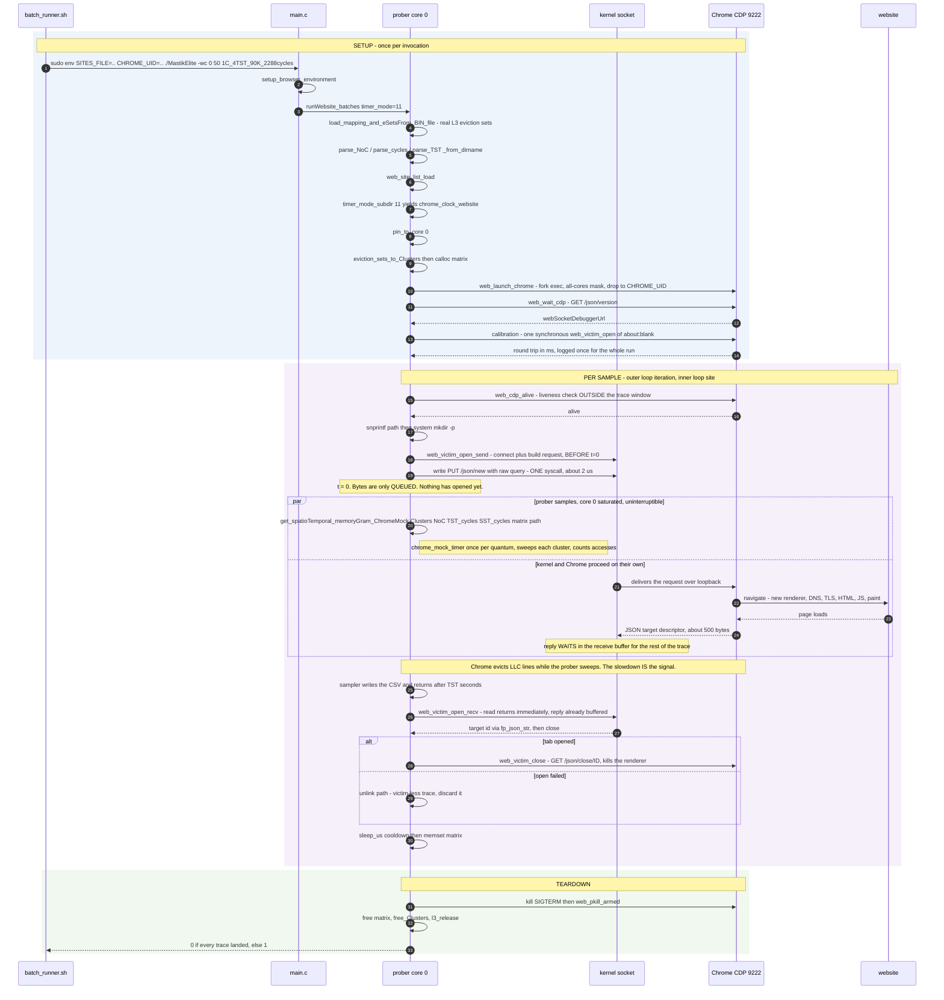

# Stage 4b sampling flow — native Mastik prober + real-website victim

Timer modes 10 (`-wn`, native clock) and 11 (`-wc`, Chrome mock clock).
Source: `stable/src/website_prober.c`, `stable/src/web_victim.c`, `stable/src/fp_ctl.c`.

**The one idea to understand.** The prober is a single thread, and the sampler does not return
for TST seconds — so "start sampling, then open the tab" is not something it can express. But
an HTTP round trip splits in two: `connect`+`write` are microseconds on loopback, while the
`read` is what waits for Chrome to create a target and spawn a renderer. So the prober sends
the request, samples for the whole trace, and reads the reply afterwards. **The kernel is the
concurrent agent — there is no helper process or thread.** The page load therefore commits a
few ms *into* the trace, which is the ordering the JS arm gets for free by having a separate
sampler process.

## Why the reply can wait

Chrome's `/json/new` response is a few hundred bytes against a default receive buffer of
128 KB+, and its DevTools endpoint holds connections open (it ignores our `Connection: close` —
see the comment in `fp_ctl.c`), so the reply simply sits there until read. `SO_RCVTIMEO` bounds
a single `read()` call; it is not a deadline on the socket's lifetime, so holding the socket
idle across the trace costs nothing. If Chrome ever *did* abort the connection, the read fails,
the sample is marked failed and its CSV unlinked — a loud failure, not silent bad data.

## Alignment

Per-sample alignment cannot be observed in this design: the reply is only read after the trace.
It also does not need to be. The offset is a property of the browser and the loopback path, not
of any particular site, so it is measured **once per run** with a throwaway synchronous open of
`about:blank` and reported as `[web] CDP round trip: N ms`. What that window contains — target
creation and renderer spawn — is essentially identical for every site, so missing it costs
little discriminability: it is a shifted origin common to all classes, not per-class noise.

## History

An earlier version forked a persistent "navigator" child that issued the CDP call over a pipe
while the parent sampled. It achieved the same ordering with ~90 lines of pipes, a line
protocol and desync handling, and it perturbed the measurement *more* at t=0 (pipe write, plus
a scheduler IPI to wake the child, plus the child's own connect and write). Deferring the read
on a single socket does the same job with one syscall.
